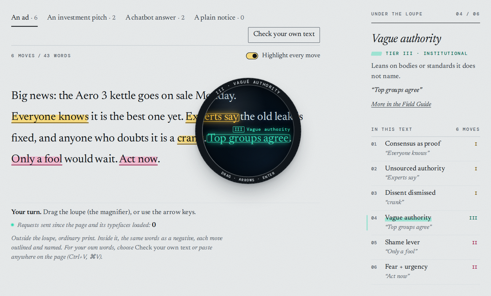

# BiasClear

[](https://github.com/biasclear/biasclear/actions/workflows/ci.yml)

**See how a text is built to move you.** BiasClear is a free persuasion checker. It marks the moves a text makes on its reader and names each one. It points at structure, never at people.

**[Try it in your browser](https://biasclear.github.io/biasclear/)** (public preview). Nothing you type is sent anywhere.

<a href="https://biasclear.github.io/biasclear/">
<picture>
  <source media="(prefers-color-scheme: dark)" srcset="docs/img/hero-dark.png">
  
</picture>
</a>

## Try it

Open **[biasclear.github.io/biasclear](https://biasclear.github.io/biasclear/)** and paste an email, a post, an ad or a chatbot answer. Each move is outlined, named and listed with its tier.

- **It runs in your browser.** The rules run inside the page. The page's code sends nothing, and its security policy lets it load files only from its own site and blocks the usual ways a script sends data (fetch, XHR, beacons, WebSockets: `connect-src 'none'`). Nothing you type is sent anywhere.
- **No cookies, no accounts.** Nothing to sign up for.
- **The moves are explained.** The [Field Guide](https://biasclear.github.io/biasclear/guide/) shows how they work, with examples and what the rules miss.

It is an alpha: 43 rules, rules version 2.0.0a5. How often the rules are right on new text has not been measured yet. See [Status and roadmap](#status-and-roadmap).

## What it catches

43 rules, sorted into three tiers from Persistent Influence Theory (PIT). The 23 general rules run on every text; 20 more are for legal, news and financial writing. Some examples, each marked by the current rules:

**Tier I, ideological: what you are told is settled.**

- Consensus as proof: "**Everyone knows** the new phone is worth the upgrade."
- Unsourced authority: "**Studies show** tomatoes grow better when you water them at dawn."
- Dissent dismissed: "Riders who say the new timetable makes them late are spreading **misinformation**."

**Tier II, psychological: how you are pushed.**

- Fear + urgency: "**Act now**, or you'll be stuck with a slow phone for years."
- Shame lever: "**Any reasonable person** would upgrade this fall."
- False binary: "**Either we raise the bake sale prices or** the class trip gets cancelled."

**Tier III, institutional: whose voice it borrows.**

- Vague authority: "**Leading organizations recommend** watering tomatoes at dawn."
- Credential as proof: "**As a roofer with 20 years of experience, I can tell you** the whole roof has to go."
- Fog language: "**Pursuant to the implementation** of the revised plan, buses will come every 20 minutes."

A tier says how a move works, not how serious it is. The [Field Guide](https://biasclear.github.io/biasclear/guide/) covers every rule, grouped by tier.

## What it is not

- **Not a fact-checker.** It checks the shape of the wording, not the facts. A marked sentence can be true, and an unmarked one can be false.
- **No truth score, no verdict.** It names moves and counts them by tier. A count is not a score, and it says nothing about what the writer meant.
- **Not about people or parties.** The rules match wording, not names. No rule lists the names of people, parties, ideologies, faiths, countries, programs, outlets, institutions or schools, and [a lint](tests/test_neutrality_lint.py) fails if a rule holds a word from its reference list of such names.
- **One exception, for sentence ends.** A shared list of abbreviations that do not end a sentence holds titles of every major faith ("Rev.", "Fr.", "Rab.", "Ust.", "Shri.", "Ven.") and both parties' "Rep." and "Dem.", treated alike. It decides only where a sentence ends, and the lint allows exactly these, in that list only ([why](rules/RULE_CHANGES.md#party-and-country-abbreviations)).
- **Not an AI model.** The rules are fixed patterns, and nothing is learned from what you paste. The same text gives the same result every time with the same engine and runtime. The Python and TypeScript engines agree on every text the tests run; they can differ only on characters newer than one runtime's Unicode version ([packages/engine](packages/engine/README.md)).
- **Not complete.** It misses persuasion put in other words, tone and insinuation. It is designed for English; coverage in other languages has not been evaluated. A quoted dismissal is marked the same as one the writer makes. The [Method page](https://biasclear.github.io/biasclear/method.html#misses) lists what the rules cannot see.

## Swapped-side tests

A rule that marks a sentence about one side, but not the same sentence about the other, is a bug. So every rule is tested with swapped pairs: the same sentence with a name or a label traded for its counterpart. Both versions must raise exactly the same rules.

- **8,313 swapped pairs**, built from 135 pairs of names and labels: parties and movements, government agencies against left- and right-leaning think tanks, colleges, news outlets, religions, nationalities, professions, and both sides of contested questions. Each pair runs in ordinary sentences and inside the frames and slots where rules hold word shapes and short lists ("Typical ___!", "Ignore the ___.", "Those ___ are at it again", the group after "leading", the object of "destroying"). The people, parties, organizations and outlets in them are made up, each with the shape of a real name; generic government bodies (such as a census bureau), faiths and nationalities are named as they are.
- **1,480 more pairs** from red-team reviews (separate AI review sessions run for this project) that tried to make the rules treat one side differently, and from the fixes that followed. All of them pass.
- **20 known limits**: pairs where the same kind of wording is marked when it is aimed at one side and not when it is aimed at the other. Each has a written reason in [rules/RULE_CHANGES.md](rules/RULE_CHANGES.md) and runs as a test that is expected to fail, so a fix shows up at once.
- **48 retired pairs**: red-team pairs that are not mirrors, such as "experts" against "historians", or a word no rule may hold (a group's own name, a movement's name, a faith's word) against a common word. They are neither run nor counted as limits. Each is listed with its reason, and where it has a true mirror, the mirror runs.

The tests cover the pairs that were written. They cannot show that no other pair differs, which is why new pairs are welcome ([Contributing](#contributing)).

The pairs are in [tests/test_symmetry.py](tests/test_symmetry.py) and run on every pull request. `python scripts/site_facts.py` counts them from the tests.

## Install and use

`pip install biasclear` is coming with the first release. Until then, run it from source. It needs Python 3.10 or later and nothing else.

```bash
git clone https://github.com/biasclear/biasclear.git
cd biasclear
python3 -m venv .venv
. .venv/bin/activate
pip install .
```

On Windows, activate the environment with `.venv\Scripts\activate`.

### In Python

```python
from biasclear import scan

result = scan("Everyone knows this kettle is the best. Top groups agree. Only a fool would wait. Act now.")
for move in result["moves"]:
    print(move["tier"], move["rule_id"], repr(move["match"]))
```

```text
1 CONSENSUS_AS_EVIDENCE 'Everyone knows'
3 VAGUE_INSTITUTIONAL_APPEAL 'Top groups agree'
2 SHAME_LEVER 'Only a fool'
2 FEAR_URGENCY 'Act now'
```

Each move also has a `name`, `domain`, `severity`, and `start` and `end` offsets into the text. `severity` is a hand-set label (low, moderate, high or critical) carried over from v1. It has not been measured, it is not a score of the text or the writer, the site does not show it, and it may be removed. `result["counts"]` gives the number of moves per tier, and `result["rules_version"]` and `result["rules_hash"]` say exactly which rules ran. `scan(text, domain="legal")` adds the legal rules to the general ones; `"media"`, `"financial"` and `"all"` work the same way.

### From a shell

It reads UTF-8 text on stdin and prints the result as JSON:

```bash
echo "Studies show this works." | python -m biasclear
python -m biasclear --domain all < draft.txt
```

### In JavaScript

The same engine in TypeScript, for browsers and Node, with no runtime dependencies: [packages/engine](packages/engine/README.md). It is not on npm yet.

## How it works

- **One rule pack.** Every rule lives in one file, [rules/biasclear-rules.json](rules/biasclear-rules.json): patterns over English wording, each with a name, a description and a PIT tier. It is the single source of truth for every engine and carries its own rules version. [rules/RULE_CHANGES.md](rules/RULE_CHANGES.md) records the changes and why, in plain words. The patterns themselves are long: letters are spelled as `[Ee]`, so that a word matches in any case while capitals still count elsewhere in the same pattern, and word lists hold both sides' words.
- **Two engines, one result.** The Python engine ([src/biasclear](src/biasclear/)) and the TypeScript engine ([packages/engine](packages/engine/)) read the same pack. [A parity script](packages/engine/scripts/parity.mjs) runs both on every pinned text and every swapped pair, in every domain, and fails on any difference. CI runs it against Python 3.10 to 3.14.
- **The site runs the same engine.** The checker loads the TypeScript engine's browser build byte for byte, and the site's build checks every example it shows against the rules ([site/README.md](site/README.md)).
- **A citation can quiet a rule.** Some rules stay quiet when something shaped like a citation, such as a name and a year in brackets, sits beside the claim. The rules check the shape of a citation, not whether the source exists.
- **No side effects.** Neither engine has runtime dependencies, makes network calls or writes files. Tests check this.

## Status and roadmap

Public preview. The Python package is version 2.0.0a1 and the rules are version 2.0.0a5, both alphas. The rules will change. Every scan from the Python and TypeScript engines returns the rules version and a hash of the exact rules that ran; the site shows the version in its header. [CHANGELOG.md](CHANGELOG.md) has the details.

Next:

- **First release.** `pip install biasclear` from PyPI. The TypeScript engine goes to npm later.
- **Measure the rules.** Run each rule on independently labeled data, starting with the SemEval-2020 Task 11 propaganda set, with a script in this repo, and publish the results together with the script.
- **Later, and optional: "explain this move."** An AI model could explain a marked phrase in plain words, called with your own API key. It would be off unless you turn it on, and labeled where you do. The rules would keep working without it.

## Contributing

Issues and pull requests are welcome. If you find a sentence the rules treat differently when you swap a name for its counterpart, [open an issue](https://github.com/biasclear/biasclear/issues/new?template=asymmetric-pair.yml) with both sentences. Pairs like that are kept as permanent tests. To report a security problem, see [SECURITY.md](SECURITY.md).

[AGENTS.md](AGENTS.md) sets out how work is done here, for people and AI agents alike: the definition of done, and the hard rules on secrets, privacy, neutrality and truthful copy. Every rule change needs positive and negative examples and swapped-pair tests.

To run the tests:

```bash
pip install '.[test]'
python -m pytest -q
```

## v1 claims withdrawn

The first version of BiasClear made claims that did not hold. They are withdrawn.

- It published F1 scores measured on the same samples its rules were tuned on, so they said nothing about new text.
- It called itself neutral, but two of its rules held lists of named institutions and schools, so the same sentence was flagged or not depending on the name in it.
- It issued "certificates" that verified nothing.

v2 replaced those rules with rules that match structure only, tests every rule with swapped pairs, and publishes no accuracy figures until a script in this repo measures them on data someone else labeled. The retired v1 code, which the PIT preprint refers to, will be kept at the tag `v1-final`, which is added to this repository after this first version is published.

## License

The code is licensed under the [Apache License 2.0](LICENSE). The retired v1 code, to be kept at the tag `v1-final`, keeps its own license, AGPL-3.0. The rule pack, `rules/biasclear-rules.json`, is licensed under [CC BY 4.0](rules/LICENSE); that also covers the copy of the pack inside the Python package, `biasclear/data/biasclear-rules.json`. The site's typefaces, Newsreader and DM Mono, are under the SIL Open Font License 1.1 ([site/fonts](site/fonts/)).

## Citation

The tiers come from Persistent Influence Theory. To cite the preprint:

```bibtex
@misc{slimp2026pit,
  title     = {Persistent Influence Theory: A Hierarchical Framework for Structural Persuasion and Information Fidelity},
  author    = {Slimp, Bradley},
  year      = {2026},
  publisher = {Zenodo},
  doi       = {10.5281/zenodo.18676405}
}
```

## Support and contact

BiasClear is free and open source, and it stays that way.

- **Follow along:** star or watch this repository to see new rules, the first measured numbers and the first release.
- **Questions and ideas:** start a thread in [Discussions](https://github.com/biasclear/biasclear/discussions), or [open an issue](https://github.com/biasclear/biasclear/issues).
- **Support the work:** [sponsor it on GitHub](https://github.com/sponsors/bws82). Sponsorship pays for the time to write and test new rules and to measure every rule on data someone else labeled.
- **Email:** hello@biasclear.com
